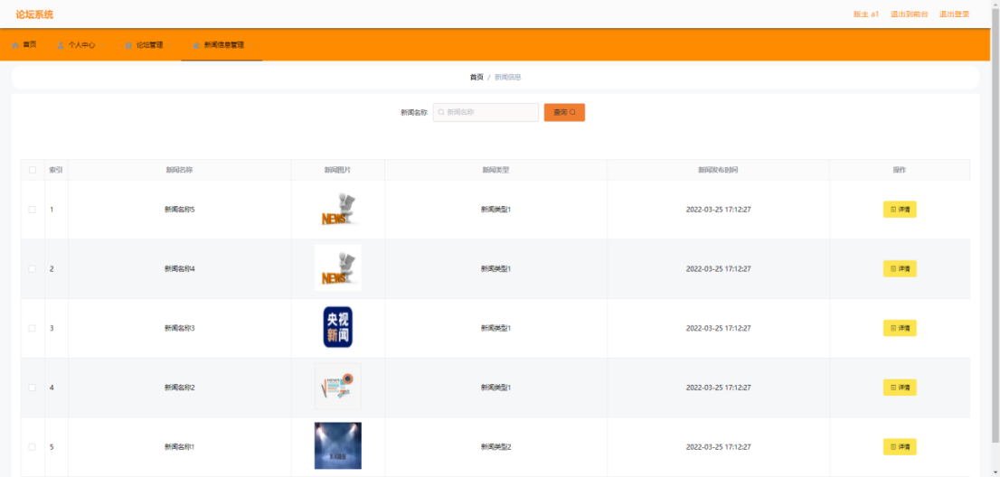

# springboot103-基于SpringBoot的论坛系统设计与实现

>  博主介绍：
>  Hey，我是程序员Chaers，一个专注于计算机领域的程序员
>  十年大厂程序员全栈开发‍ 日常分享项目经验 解决技术难题与技术推荐 承接各类网站设计，小程序开发，毕设等。
>  【计算机专业课程设计，毕业设计项目，Java，微信小程序，安卓APP都可以做，不仅仅是计算机专业，其它专业都可以】

## 3000套系统可挑选，获取链接：https://chaerspol.github.io/

<b>QQ【获取完整源码】：674456564</b>

<b>QQ群【获取完整源码】：1058861570</b>

### 系统架构

> 前端：html | js | css | jquery | vue
>
> 后端：springboot | mybatis
> 
> 环境：jdk1.8+ | mysql | maven

# 一、内容包括
包括有  项目源码+项目论文+数据库源码+答辩ppt+远程调试成功

# 二、运行环境

> jdk版本：1.8 及以上； ide工具：IDEA； 数据库: mysql5.7及以上；编程语言: Java

# 三、需求分析

**3.1可行性分析**

系统是否可以正常实现操作流程，实现操作目的，符合操作流程，这些都可以提前进行分析论证。提前进行分析在开发之前是很重要的，并且进行书面记载，有助于开发流程的缜密性。

**3.1.1运行可行性分析**

开发论坛系统必然是有运行条件的，开发条件和运行条件都可以进行分析。首先从运行角度上讲，只是作为一个论坛系统的运行环境，不是超大型商业项目，只是运行一个毕业设计，数据量有限，并发条件有限，所以用常规的内存大于4G，CPU双核以上，基本上就能满足运行的硬件需要，硬盘的话常规的大于60G的即可。

**3.1.2技术可行性分析**

一切可以实现B/S模式的技术很多，而正好在学校就学习了相关的开发技术，采用已经有基础的学习来进行扩展更丰富的功能，从技术上面是不需要太多的重复性投入，可以更快的进行开发，技术可行。

**3.1.3经济可行性分析**

经济主要考虑投入与获利之间的比例问题，论坛系统开发投入只需要现有的，不必要另外购买的电脑就可以进行使用，一切开放性所用到的工具和资料都可以在图书馆以及互联网上面得到相应的免费资讯，这些都决定了经济上面的投入是不需要太多的。项目功能属于常规功能，没有多并发超用户同时访问的需求，所以也不需要考虑太多的资金投入，所以经济可行。
通过各个方面的研究分析，确定了开发之前这些可行性分析是很有必要的，增加了开发的信心，提高了开发效率，让开发的流程更加的具体化。

**3.2系统流程分析**

本项目在处理数据方面，必须规定其流程，要让每个步骤都要符合设定预期。注册的结果可以说只有两种结果，一个是成功，一个是失败，成功就会把注册时候输入的数据写入到数据库表里存储，如果失败则提示提示失败，并且不写入数据库。因为两种结果，所以要对数据的合法性进行判断，而数据的合法性需要对每条信息进行判断，主要对哪条信息判断，这些都要有流程。

# 四、功能模块

本小节运用功能结构图来描述管理员具备的详细的功能，对管理员的功能结构图绘制结果如下图所示。管理员管理论坛，主要是对论坛帖子增删改查以及对论坛帖子回复进行查看，对版主和用户进行管理，管理新闻等

本小节运用功能结构图来描述版主具备的详细的功能，对版主的功能结构图绘制结果如下图所示。版主可以发布帖子，可以查询论坛帖子，可以对论坛帖子回复进行查看，可以回复帖子，可以删除帖子，可以查看新闻，更改个人信息等。

本小节运用功能结构图来描述用户具备的详细的功能，对用户的功能结构图绘制结果如下图所示。用户在前台查看新闻，在留言版对发布的留言和管理员的回复进行查看，在论坛模块发帖，评论帖子，查看帖子

# 五、效果图展示【部分效果图】

图5.1 版主管理界面【管理员点击导航栏的版主管理链接就进入版主管理界面。版主管理界面如下图所示。本功能允许管理员对版主的基本资料进行修改，添加，查询，删除】

图5.2 用户管理界面【管理员点击导航栏的用户管理链接就进入用户管理界面。用户管理界面如下图所示。本功能允许管理员对用户基础资料进行修改，查询，添加，删除】

图5.3 留言版管理界面【管理员点击导航栏的留言版管理链接就进入留言版管理界面。留言版管理界面如下图所示。本功能允许管理员查看用户留言，通过用户姓名或留言标题查询留言，回复留言内容，删除留言等】

图5.4 论坛管理界面【版主点击导航栏的论坛管理链接就进入论坛管理界面。论坛管理界面如下图所示。版主新增论坛帖子，论坛帖子有发帖时间，帖子标题，身份，姓名，手机号，帖子类型等信息，发布帖子之后，版主可以对论坛帖子的回复随时进行查看。】

图5.5 新闻信息查看界面【版主点击导航栏的新闻信息查看链接就进入新闻信息查看界面。新闻信息查看界面如下图所示。本功能允许版主查询新闻，对新闻内容，包括新闻标题在内的新闻信息进行查看】

 <b>完整文章</b>
 
 
 

## 3000套系统可挑选，获取链接：https://chaerspol.github.io/

<b>QQ【获取完整源码】：674456564</b>

<b>QQ群【获取完整源码】：1058861570</b>

